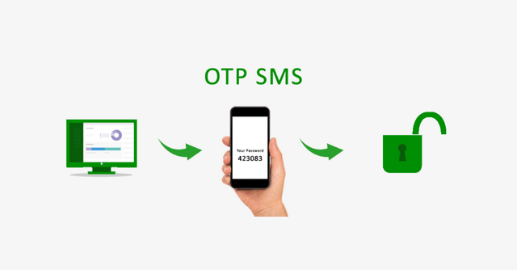

## Laravel Login Otp Authentication

Two-factor authentication (2FA) adds an extra layer of security to your application by requiring users to provide a second factor of authentication, usually a code generated by an authentication app or sent via SMS. OTP stands for "one-time password", which means that the code is only valid for a short period of time and cannot be reused.

## Installation

Here is the complete video of the usage and installation of the package.

<a href="https://www.youtube.com/watch?v=gjDkagdKp4U" onclick="window.open(this.href,'_blank');return false;">
  
</a>

#### Step 1: Install Laravel

This is optional; however, if you have not created the laravel app, then you may go ahead and execute the below command:

```
composer create-project laravel/laravel example-app
```

#### Step 2: Setup Database Configuration

After successfully installing the laravel app then after configuring the database setup. We will open the ".env" file and change the database name, username and password in the env file.

```
DB_CONNECTION=mysql
DB_HOST=127.0.0.1
DB_PORT=3306
DB_DATABASE=Enter_Your_Database_Name
DB_USERNAME=Enter_Your_Database_Username
DB_PASSWORD=Enter_Your_Database_Password
```

#### Step 3: Install Auth Scaffold

Laravel's laravel/ui package provides a quick way to scaffold all of the routes and views you need for authentication using a few simple commands:
```
composer require laravel/ui
```

Next, we need to generate auth scaffold with bootstrap, so let's run the below command:

```
php artisan ui bootstrap --auth
```

Then, install npm packages using the below command

```
npm install
```
At last, built bootstrap CSS using the below command:

```
npm run dev
```

### Package Installation

```
composer require bushart/otploginauthentication
```

#### Run Command
Now, run migration with following command:

```
php artisan auth:otp
```

Now, run migration with following command:

```
php artisan migrate
```

#### Step 4:  Update Register Controller.

##### Update the below functions in the register controller.

```
 /**
     * Get a validator for an incoming registration request.
     *
     * @param  array $data
     * @return \Illuminate\Contracts\Validation\Validator
     */
    protected function validator(array $data)
    {
        return Validator::make($data, [
            'name' => ['required', 'string', 'max:255'],
            'email' => ['required', 'string', 'email', 'max:255', 'unique:users'],
            'mobile_no' => ['required', 'regex:/^\+(?:[0-9] ?){6,14}[0-9]$/', 'unique:users'],
            'password' => ['required', 'string', 'min:8', 'confirmed'],
        ]);
    }

    /**
     * Create a new user instance after a valid registration.
     *
     * @param  array $data
     * @return \App\Models\User
     */
    protected function create(array $data)
    {
        return User::create([
            'name' => $data['name'],
            'email' => $data['email'],
            'mobile_no' => str_replace(' ', '', $data['mobile_no']),
            'password' => Hash::make($data['password']),
        ]);
    }
```

#### Step 5: Configure sender mail address in laravel .env file

##### .env file:
```
MAIL_DRIVER=smtp
MAIL_HOST=smtp.mailtrap.io
MAIL_PORT=587
MAIL_USERNAME=null
MAIL_PASSWORD=null
MAIL_ENCRYPTION=TLS
```

#### Step 6: Create Twilio Account

First you need to create and add phone number. then you can easily get account SID, Token and Number.

Create Account from here: www.twilio.com.

Next add Twilio Phone Number

Next you can get account SID, Token and Number and add these in the .env file like bellow:
#### .env
```
TWILIO_ACCOUNT_SID=XXXXXXXXXXXXXXXXX
TWILIO_AUTH_TOKEN=XXXXXXXXXXXXX
TWILIO_NUMBER=+XXXXXXXXXXX
```


All the required steps have been done, now you have to type the given below command and hit enter to run the Laravel app:

```
php artisan serve
```

Now, Go to your web browser, type the given URL and view the app output:

```
http://localhost:8000/login
```
##### I hope it can help you...